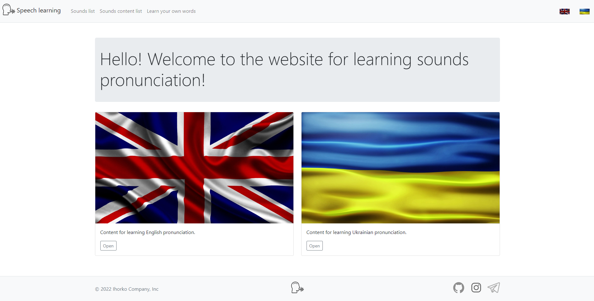
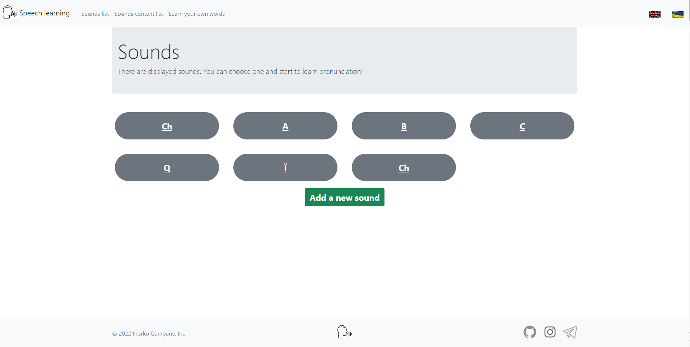
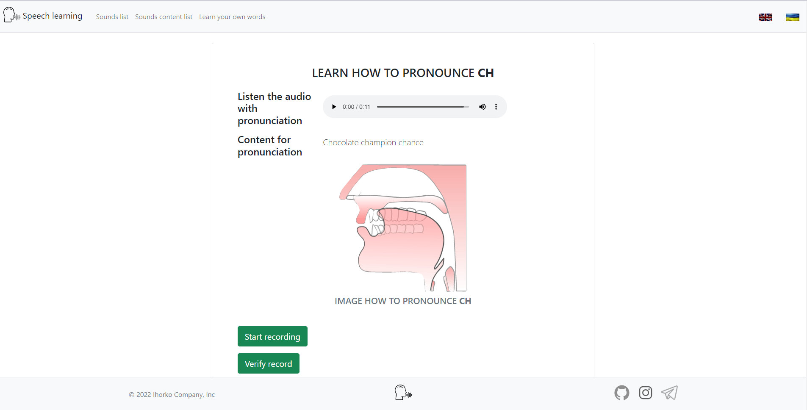

# Speech Learning

## About

- Web-based interactive application for learning the correct pronunciation of sounds using Spring technologies.
- Application created using Java, Python, JavaScript. For User Interface I use Bootstrap, HTML/CSS, Thymeleaf.

## Used frameworks and libraries

- spring-boot
- spring-orm
- gson
- commons-collections4
- hibernate-core
- tomcat-dbcp
- lombok
- postgresql

## Author

- [@KucheriavyiIhor](https://github.com/Ascomos21)

#### Опис українською

## Про додаток

- Інтерактивний веб-додаток для навчання правильної вимови звуків за технологіями Spring.
- Додаток, створений за допомогою Java 11, Python, PostgreSql, JavaScript. Для інтерфейсу користувача я використовую
  Bootstrap, HTML/CSS, Thymeleaf.

## Починаємо

1. Потрібно мати встановлені Java 11+, PostgreSql та Python 3.9+
2. Налаштувати змінні середовища (якщо користувач Windows)
3. Встановити наступні бібліотеки Python: google-cloud-speech, PyAudio, pyttsx3, SpeechRecognition
4. Склонувати репозиторій
```sh
   git clone https://github.com/Ascomos21/speech_recognition
   ```
5. Для успішної локалізації мовою яка використовує кирилицю налаштувати файл properties на charset - UTF-8
6. В класі ihorko/work/speech_recognition/db/util/HibernateConfig.java в методі DataSource ввести назву своєї бази
   даних, пароль та ім'я користувача

```sh
 dataSource.setUrl("jdbc:postgresql://localhost:5432/{db-name}");
        dataSource.setUsername("{username}");
        dataSource.setPassword("{password}");
```

## Зображення

#### Головна сторінка



#### Сторінка списку звуків



#### Сторінка матеріалу для вивчення



## Автор

- [@KucheriavyiIhor](https://github.com/Ascomos21)
